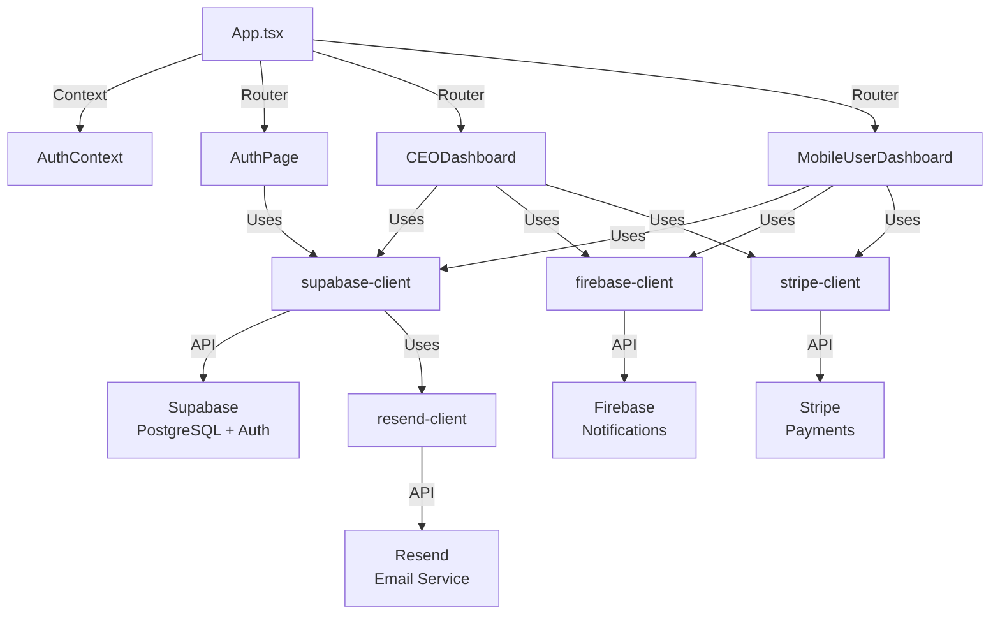

# Project Analysis: ZAYIA Platform

**Generated:** 2026-02-21
**Generated By:** @architect (Aria)
**Story:** WIS-15

---

## Project Overview

ZAYIA is a personal AI coaching platform for women, built as a dual-dashboard web application. The platform provides two distinct interfaces:
- **CEO Dashboard:** Administrative and management interface for coaches
- **User Dashboard:** Client-facing personal coaching platform

---

## Project Structure

| Aspect | Value |
|--------|-------|
| Framework | React 18 + TypeScript 5.2 |
| Build Tool | Vite 5.0 |
| Styling | Tailwind CSS 3.4 |
| Primary Language | TypeScript (100% in src/) |
| Backend | Supabase (PostgreSQL + Auth + Real-time) |
| External Services | Firebase (notifications), Stripe (payments), Resend (email) |
| Testing Framework | None configured |
| Linting | ESLint strict mode (max warnings: 0) |
| Code Files | 43 TypeScript/TSX files |

---

## Directory Structure

```
project/
├── src/
│   ├── App.tsx                          # Root router (Auth → CEO/User dashboards)
│   ├── main.tsx                         # React 18 entry point (service worker registration)
│   ├── index.css                        # Global styles
│   ├── components/
│   │   ├── auth/                        # Authentication: Login, SignUp, AuthPage
│   │   ├── ui/                          # Reusable UI: Logo, LoadingSpinner, CustomIcons
│   │   ├── widgets/                     # Dashboard widgets: ChallengesStatsWidget, etc.
│   │   ├── user/                        # User dashboard (MobileUserDashboard + sections)
│   │   │   └── sections/                # DashboardSection, ChallengesSection, RankingSection
│   │   └── ceo/                         # CEO dashboard (CEODashboard + 9+ management sections)
│   ├── contexts/
│   │   └── AuthContext.tsx              # Global auth state (user, role, profile)
│   ├── lib/                             # Utilities & API clients
│   │   ├── firebase-client.ts           # Firebase SDK initialization & functions
│   │   ├── stripe-client.ts             # Stripe integration
│   │   ├── supabase-client.ts           # Supabase client & database operations
│   │   ├── resend-client.ts             # Email service integration
│   │   ├── integrations.ts              # Service orchestration
│   │   ├── integrations-manager.ts      # Multi-service manager
│   │   ├── notificationScheduler.ts     # Background notification scheduler
│   │   ├── emailTemplates.ts            # Email template definitions
│   │   └── utils.ts                     # Helper utilities
│   └── data/                            # JSON coaching categories
│       ├── corpo_saude.json             # Physical Health
│       ├── carreira.json                # Career
│       ├── relacionamentos.json         # Relationships
│       ├── mindfulness.json
│       ├── digital_detox.json
│       ├── rotina.json
│       ├── compliance.json
│       └── autoestima.json
├── supabase/                            # Database migrations & config
├── public/                              # Static assets
├── vite.config.ts
├── tsconfig.json
├── tailwind.config.js
└── .env                                 # Environment variables
```

---

## Existing Services & Integrations

| Service | Purpose | Type | Status |
|---------|---------|------|--------|
| **Supabase** | PostgreSQL database, Auth, Real-time | Backend Database | Primary |
| **Firebase** | Push notifications | External Service | Integrated |
| **Stripe** | Payment processing | External Service | Integrated |
| **Resend** | Email service | External Service | Integrated |

---

## Technology Stack Analysis

### Frontend Layer
- **Framework:** React 18 with hooks-based components
- **Language:** TypeScript (strict mode enabled)
- **Bundler:** Vite 5.0 (lightning-fast dev server)
- **UI Components:** Lucide React (0.303) for icons
- **Styling:** Tailwind CSS 3.4 with custom ZAYIA purple/violet theme
- **Utilities:** clsx, tailwind-merge for conditional styling

### Backend Layer
- **Database:** Supabase (PostgreSQL)
- **Authentication:** Supabase Auth (built-in)
- **Real-time:** Supabase Real-time subscriptions
- **Email:** Resend API for transactional emails
- **Notifications:** Firebase Cloud Messaging (push notifications)
- **Payments:** Stripe API for payment processing

### Client Libraries
```json
{
  "@supabase/supabase-js": "^2.39.3",
  "lucide-react": "^0.303.0",
  "firebase": "^12.1.0",
  "react": "^18.2.0",
  "react-dom": "^18.2.0"
}
```

---

## Code Patterns & Conventions

### 1. Component Organization
**Pattern:** Feature-based component hierarchy

```
components/
├── auth/               # Authentication features
├── ceo/                # CEO dashboard features
├── user/               # User dashboard features (with sections/)
├── ui/                 # Reusable, dumb components
└── widgets/            # Dashboard widget components
```

**Convention:** Components are organized by feature area, with `ui/` reserved for reusable presentational components.

### 2. State Management
**Pattern:** React Context API

- **AuthContext.tsx** provides global authentication state
- `user`, `profile`, `role` available throughout app
- Role-based routing in App.tsx

**Convention:** No Redux/Zustand; Context API sufficient for current scope.

### 3. API Client Pattern
**Location:** `src/lib/`

Each external service has dedicated client files:
- `supabase-client.ts` - Database operations
- `firebase-client.ts` - Notification setup
- `stripe-client.ts` - Payment operations
- `resend-client.ts` - Email sending

**Pattern:** Factory functions with proper error handling.

### 4. Data Organization
**Location:** `src/data/`

Coaching categories stored as JSON files:
```json
{
  "id": "category-id",
  "name": "Display Name",
  "challenges": [
    { "id": "c1", "title": "...", "description": "..." }
  ]
}
```

**Convention:** Each category is a separate JSON file imported directly into components.

### 5. Styling Approach
**Framework:** Tailwind CSS with custom theme

- **Theme:** Custom purple/violet palette defined in `tailwind.config.js`
- **Utilities:** `clsx` for conditional classes, `tailwind-merge` for conflicts
- **Approach:** Utility-first CSS with no component framework
- **Global styles:** `index.css` for base styles

### 6. Error Handling
**Pattern:** Try-catch with console.error logging

```typescript
try {
  // Operation
} catch (error) {
  console.error(`Error in operation:`, error);
  // User-facing error message
}
```

### 7. Type Safety
**Configuration:** TypeScript strict mode enabled

- `strict: true` in tsconfig.json
- `noUnusedLocals`, `noUnusedParameters`, `noFallthroughCasesInSwitch` all enabled
- No `any` types unless justified with comment

---

## Architecture Patterns

### 1. Authentication Flow
```
AuthContext (global state)
    ↓
App.tsx routes based on role
    ↓
AuthPage (login/signup) → CEODashboard or MobileUserDashboard
```

### 2. Service Integration Pattern
```
components/
    ↓
useContext(AuthContext)
    ↓
lib/{service}-client.ts
    ↓
External API (Supabase, Firebase, Stripe, Resend)
```

### 3. Dashboard Architecture
- **CEO Dashboard:** Grid layout with management sections
- **User Dashboard:** Mobile-first responsive design
- **Widgets:** Reusable dashboard widgets (ChallengesStatsWidget, etc.)
- **Sections:** Dashboard sections split into separate components for maintainability

---

## Quality & Linting

| Aspect | Configuration |
|--------|---------------|
| **Linting** | ESLint with TypeScript support, max warnings: **0** |
| **Type Checking** | TypeScript strict mode |
| **Code Style** | ESLint rules + Prettier-compatible formatting |
| **Pre-commit** | ESLint must pass before any commit |

**Build Pipeline:**
```bash
npm run lint    # Must pass with 0 warnings
npm run build   # TypeScript checking + Vite build
npm run dev     # Local development (http://localhost:5173)
```

---

## Services & Dependency Inventory

### External API Dependencies
| Service | Library | Version | Purpose |
|---------|---------|---------|---------|
| Supabase | @supabase/supabase-js | ^2.39.3 | Database & Auth |
| Firebase | firebase | ^12.1.0 | Push notifications |
| Stripe | (integrated) | (custom) | Payment processing |
| Resend | (custom client) | (custom) | Email service |

### UI/UX Dependencies
| Package | Version | Purpose |
|---------|---------|---------|
| lucide-react | ^0.303.0 | Icon library |
| clsx | ^2.0.0 | Conditional classnames |
| tailwind-merge | ^2.2.0 | Tailwind class merging |

### Development Dependencies
| Tool | Version | Purpose |
|------|---------|---------|
| TypeScript | ^5.2.2 | Type safety |
| Vite | ^5.0.8 | Build tool |
| Tailwind CSS | ^3.4.0 | Styling framework |
| ESLint | ^8.55.0 | Code linting |

---

## Current Capabilities

### ✅ Fully Implemented
- User authentication (login/signup with Supabase Auth)
- Dual-dashboard routing (CEO vs User based on role)
- Real-time notifications (Firebase)
- Payment processing (Stripe)
- Email communications (Resend)
- Responsive design (mobile-first)
- Dark/light mode support (via Tailwind)

### ⚠️ Partial/Needs Enhancement
- Testing suite (no unit/integration tests configured)
- Error boundaries (not implemented)
- Accessibility (a11y standards not comprehensively covered)
- Performance monitoring
- Analytics tracking

### ❌ Not Implemented
- Service worker for offline support
- Database caching layer
- Feature flags / A/B testing
- API rate limiting on frontend
- Advanced error recovery

---

## Observations & Recommendations

### Strengths
1. **Clean architecture** - Clear separation between UI, business logic, and services
2. **Type safety** - Strict TypeScript with excellent DX
3. **Modern stack** - React 18, Vite, Tailwind = excellent performance
4. **Service integration** - Well-organized API clients with proper error handling
5. **Scalable component structure** - Feature-based organization supports growth

### Areas for Improvement
1. **No testing framework** - Should add Jest/Vitest for unit & integration tests
2. **Error handling** - Lacks error boundaries and user-facing error messages
3. **Performance monitoring** - No analytics or performance tracking
4. **Documentation** - Limited inline documentation and JSDoc comments
5. **Accessibility** - No comprehensive a11y audit or WCAG compliance

---

## Next Steps for Enhancement

1. **Add testing framework** (Jest or Vitest)
2. **Implement error boundaries** for React components
3. **Add Sentry or similar** for error tracking
4. **Improve accessibility** - ARIA labels, focus management, keyboard nav
5. **Performance optimization** - Code splitting, lazy loading, caching strategy
6. **Documentation** - JSDoc, component storybook, architecture guides

---

## Dependencies Map



---

## File Structure Summary

- **Total TypeScript files:** 43
- **Component files:** ~28
- **Service/utility files:** ~12
- **Configuration files:** 3
- **Lines of code:** ~4,000+ (estimated)

---

*Analysis complete. This document provides a comprehensive overview of the ZAYIA architecture and can be used as a reference for future development decisions.*
